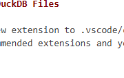

# bintel-04-warehouse

[](https://denisecase.github.io/pro-analytics-02/workflow-b-apply-example-project/)
[](./pyproject.toml)
[](./LICENSE)

> Professional Python project: building and populating a smart sales data warehouse using ETVL.

## Project Description

This project focuses on designing a star schema data warehouse
and loading prepared data into it using the ETVL process:
Extract from prepared CSV files, Transform for the warehouse schema,
Verify row counts and integrity, then Load into SQLite.

We work with cleaned smart sales data containing
customers, products, and sales records.

We learn to:

- create a DuckDB data warehouse programmatically
- extract and transform prepared CSV data for the warehouse schema
- verify tables are populated correctly before and after loading
- query the warehouse to confirm data integrity

## Use Your Prepared Data

After running the example,
copy over your data/prepared/ files to use in this project.

## VS Code and DuckDB Files

We've added a new extension to
[**.vscode/extensions.json**](.vscode/extensions.json) to interact with DuckDB.
Accept the recommended extensions and you should get it. If not:

- Open the **Extensions left-side tab** in VS Code.
- Search for: DuckDB
- Install the extension published by **chuckjonas**.

In this project, we create and populate a dw file in the new **artifacts/** folder.
To explore the new DuckDB, open the new **DuckDB left-side tab** in VS Code
and select **smart_sales**.



The extension is configured in [**.vscode/settings.json**](.vscode/settings.json).
Change this `settings.json` file to reflect any changes you make, e.g. a new database name.

## Working Files

You'll work with these areas:

- **.vscode/extensions.json** - see the additional "chuckjonas.duckdb" extension
- **.vscode/settings.json** - configure the project DuckDB file (if changes needed)
- **artifacts/** - generated data warehouse file
- **data/prepared** - paste your prepared CSV files (e.g., customers, products, sales)
- **docs/** - provides project narrative and documentation
- **src/bizintel/** - run the examples; copy and paste to your own versions to modify
- **pyproject.toml** - update authorship & links
- **zensical.toml** - update authorship & links

## Instructions (pro-analytics-02)

Follow the
[step-by-step workflow guide](https://denisecase.github.io/pro-analytics-02/workflow-b-apply-example-project/)
to complete:

1. Phase 1. **Start & Run**
2. Phase 2. **Change Authorship**
3. Phase 3. **Read & Understand**
4. Phase 4. **Modify**
5. Phase 5. **Apply**

## Challenges

Challenges are expected.
Sometimes instructions may not quite match your operating system.
When issues occur, share screenshots, error messages, and details about what you tried.
Working through issues is part of implementing professional projects.

## Success

After completing Phase 1. **Start & Run**,
you'll have your own GitHub project,
and running the example module will print out:

```shell
========================
Executed successfully!
========================
```

A new file `project.log` will appear in the root project folder.

## Command Reference

<details>
<summary>Show command reference</summary>

### In a machine terminal (open in your `Repos` folder)

After you get a copy of this repo in your own GitHub account,
open a machine terminal in your `Repos` folder:

```shell
# Replace username with YOUR GitHub username.
git clone https://github.com/username/bintel-04-warehouse

cd bintel-04-warehouse
code .
```

### In a VS Code terminal

These are listed for convenience.
For best results, follow the detailed instructions in
[pro-analytics-02 guide](https://denisecase.github.io/pro-analytics-02/).

```shell
uv self update
uv python pin 3.14
uv lock --upgrade
uv sync --extra dev --extra docs --upgrade

uvx pre-commit install
uvx pre-commit autoupdate

git add -A
uvx pre-commit run --all-files
# repeat if changes were made
uvx pre-commit run --all-files

# verify the environment (.venv/)
uv run python -m bizintel.app_case

# Workflow 1: build an empty data warehouse in artifacts/
uv run python -m bizintel.dw_create_case

# Workflow 3: etl (extract-transform-load) prepared data into dw
uv run python -m bizintel.etl_case

# run common chores
uv run ruff format .
uv run ruff check . --fix
uv run python -m pyright
uv run python -m pytest
uv run python -m zensical build

# save progress
git add -A
git commit -m "update"
git push -u origin main
```

</details>

## Notes

- Use the **UP ARROW** and **DOWN ARROW** in the terminal to scroll through past commands.
- Use `CTRL+f` to find (and replace) text within a file.
- You do not need to add to or modify `tests/`. They are provided for example only.
- Many files are silent helpers. Explore as you like, but nothing is required.
- You do NOT need to understand everything; understanding builds naturally over time.

## Troubleshooting >>>

If you see something like this in your terminal: `>>>` or `...`
You accidentally started Python interactive mode.
It happens.
Press `Ctrl+c` (both keys together) or `Ctrl+Z` then `Enter` on Windows.

## Troubleshooting "File Used By Another Process"

If you try to run Python that interacts with the DuckDB file and get an error that a
file is being used by another process, just
click the **DuckDB left-side tab**, right-click your database and select **Detach Database**.

## Workflow 1. Example Output (Remove or Replace this Section after You Verify)

```shell
| INFO | BI | START verify warehouse schema....
| INFO | BI | SHOW TABLES returns a list of all tables in the database
| INFO | BI | - Calling .fetchall() on the result of SHOW TABLES
| INFO | BI | - Gets the result - we can store it in a variable named 'tables'
| INFO | BI |   - Retrieved tables from the warehouse.
| INFO | BI |  - tables has a tuple for each table in the warehouse
| INFO | BI |  - the first tuple element (at the 0 index) is the table name
| INFO | BI |   Tables in warehouse: ['dim_customers', 'dim_products', 'fact_sales']
| INFO | BI | Workflow 1-CREATE DW complete
| INFO | BI | ========================
| INFO | BI | Executed successfully!
| INFO | BI | ========================
```

## Workflow 2. Example Output (Remove or Replace this Section after You Verify)

```shell
| INFO | BI | ========================
| INFO | BI | ROW COUNTS AFTER LOAD
| INFO | BI | ========================
| INFO | BI | CALL a function to verify row counts........
| INFO | BI |   PASS: dim_customers has 200 rows
| INFO | BI |   PASS: dim_products has 100 rows
| INFO | BI |   PASS: fact_sales has 2392 rows
| INFO | BI | Workflow 2-ETL complete
| INFO | BI | ========================
| INFO | BI | Executed successfully!
```

## Findings and Visuals

Take screenshots of your charts and provide them here with a discussion.
In Markdown, display a figure using:
an exclamation mark immediately followed by square brackets containing a useful caption
immediately followed by parentheses containing the relative path to your figure.

In your custom project:

- your figures and narrative should reflect your work
- this `README.md` should include your commands, process, and visuals
- `docs/index.md` should include your narrative

Replace these placeholders with screenshots from your own project run:


## Project Documentation

Additional project instructions, terms, and notes:

[docs/index.md](docs/index.md)

## Citation

[CITATION.cff](./CITATION.cff)

## License

[MIT](./LICENSE)
